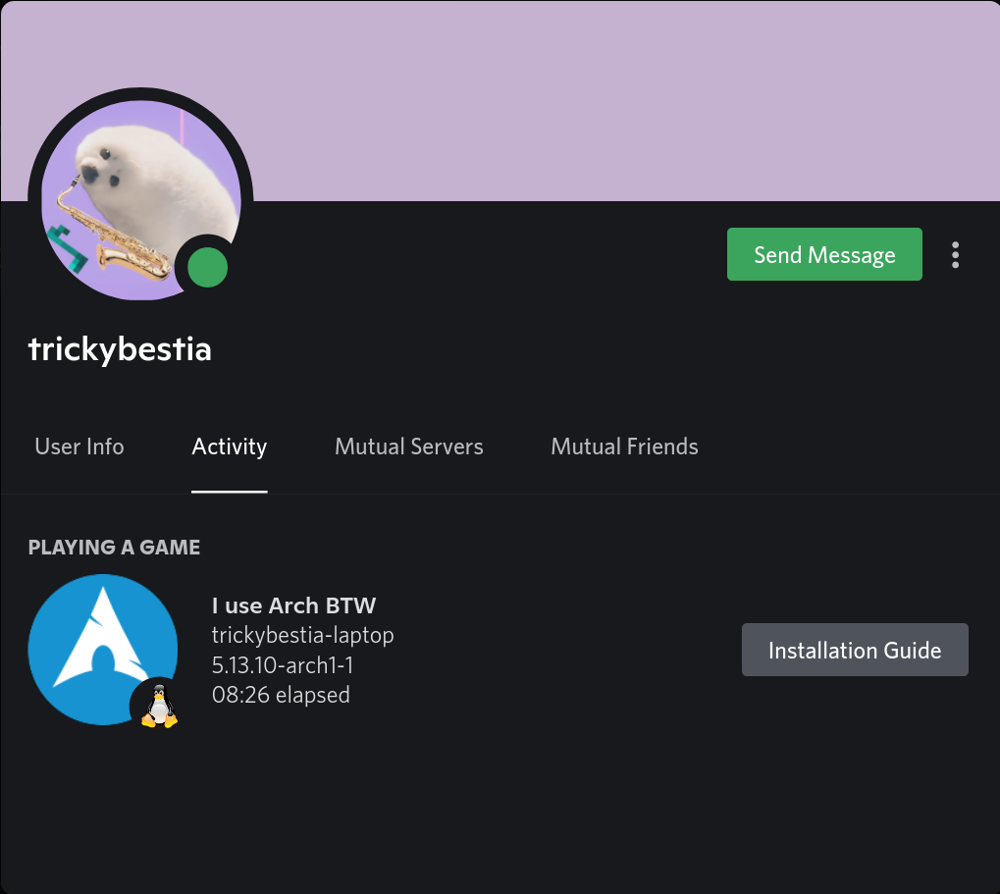

# linux-discord-rich-presence

**Customizable Discord Rich Presence client for Linux**

---

## Showcase




## Features

* Set Discord Rich Presence Activity's state, details, large image, large image hover text, small image, small image hover text, start and end timestamps.
* Config file in any format.
* Dynamic config file reloading.

## How to download

1. Go to the [Releases page](https://github.com/trickybestia/linux-discord-rich-presence/releases), find the latest release and download `linux-discord-rich-presence` asset from it.
2. Move it to the `/bin/` and make it executable.

## How to build

1. [Install Rust](https://rustup.rs/).
2. Run the following shell script:
```sh
git clone https://github.com/trickybestia/linux-discord-rich-presence.git
cd linux-discord-rich-presence
cargo build --release
cp ./target/release/linux-discord-rich-presence ../linux-discord-rich-presence-bin
cd ..
rm -rf ./linux-discord-rich-presence
strip linux-discord-rich-presence-bin
sudo mv -f ./linux-discord-rich-presence-bin /bin/linux-discord-rich-presence
```

## How to install 

Create `~/.config/linux-discord-rich-presencerc` from the following template (do not forget to make it executable!):
##### Sh template
```sh
#!/bin/sh

application_id () {
    echo your_application_id_here
}

update_delay () {
    echo 10
}

state () {
    uname -r
    # or
    # echo
}

details () {
    uname -n
    # or
    # echo
}

large_image_key () {
    echo your_large_image_key_here
    # or
    # echo
}

large_image_text () {
    echo your_large_image_text_here
    # or
    # echo
}

small_image_key () {
    echo your_small_image_key_here
    # or
    # echo
}

small_image_text () {
    echo your_small_image_text_here
    # or
    # echo
}

start_timestamp () {
    date -d "$(uptime -s)" +%s
    # or
    # echo
}

end_timestamp () {
    echo
}

buttons () {
    # \u0091 is a delimiter
    echo -e 'button1\u0091https://button1\u0091button2\u0091https://button2'
    # or
    # echo -e 'button1\u0091https://button1'
    # or
    # echo
}

while true
do
    read command
    eval $command
done
```
##### Python template
```python
#!/bin/python

from os import popen

def application_id():
    return your_application_id_here

def update_delay():
    return 10

def state():
    with popen('uname -r') as process:
        return process.read()[0:-1]
    # or
    # return ''

def details():
    with popen('uname -n') as process:
        return process.read()[0:-1]
    # or
    # return ''

def large_image_key():
    return 'your_large_image_key_here'
    # or
    # return ''

def large_image_text():
    return 'your_large_image_text_here'
    # or
    # return ''

def small_image_key():
    return 'your_small_image_key_here'
    # or
    # return ''

def small_image_text():
    return 'your_small_image_text_here'
    # or
    # return ''

def start_timestamp():
    with popen('date -d "$(uptime -s)" +%s') as process:
        return process.read()[0:-1]
    # or
    # return ''

def end_timestamp():
    return ''

def buttons():
    return 'button1\u0091https://button1\u0091button2\u0091https://button2'
    # or
    # return 'button1\u0091https://button1'
    # or
    # return ''

try:
    while True:
        command = input()
        print(eval(command + '()'))
except EOFError:
    ...
```


## How to use

Run the following command:
```sh
linux-discord-rich-presence -c ~/.config/linux-discord-rich-presencerc
```
